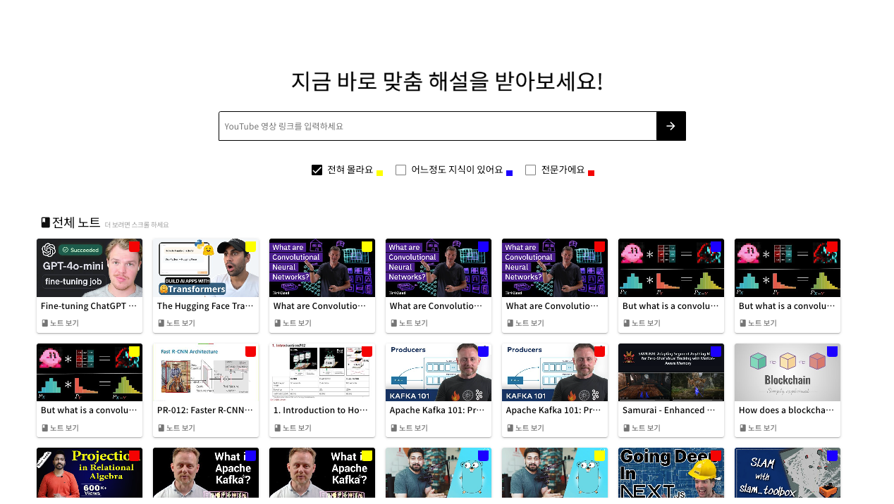
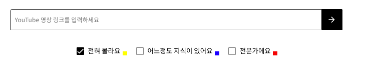
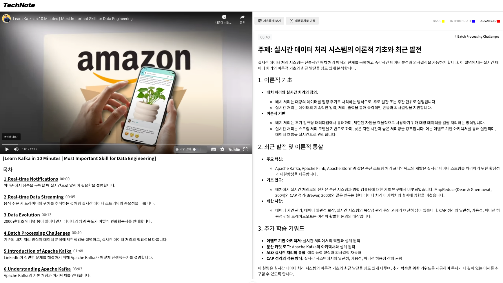

# Tech Note
‘Tech Note’는 사용자 수준에 맞춰 IT 테크 영상에 대한 해설 노트를 제공하는 서비스입니다.

## 서비스 설명

생성된 노트를 보거나, 새로운 노트를 생성할 수 있습니다.

 

영상 링크와 사용자 수준을 입력하면 AI가 해설 노트를 제작합니다.

 

사용자가 노트를 편리하게 볼 수 있도록 다음과 같은 기능을 제공합니다.
- 영상 따라가기: 영상이 재생되는 구간에 맞춘 해설이 표시됩니다.
- 자유롭게 보기: 영상 전 구간에 대한 해설을 스크롤을 통해 자유롭게 볼 수 있습니다. '재생위치로 이동'버튼을 누르면, 영상이 재생되는 구간으로 이동합니다.
- 해설 수준 전환: 선택한 해설 수준으로 노트가 전환됩니다.
  

 
 

사용자가 완전한 노트를 보기까지 약 2분이 소요됩니다. 사용자 경험을 향상시키고자 노트 생성 진행상황을 표시하도록 구성했습니다.

